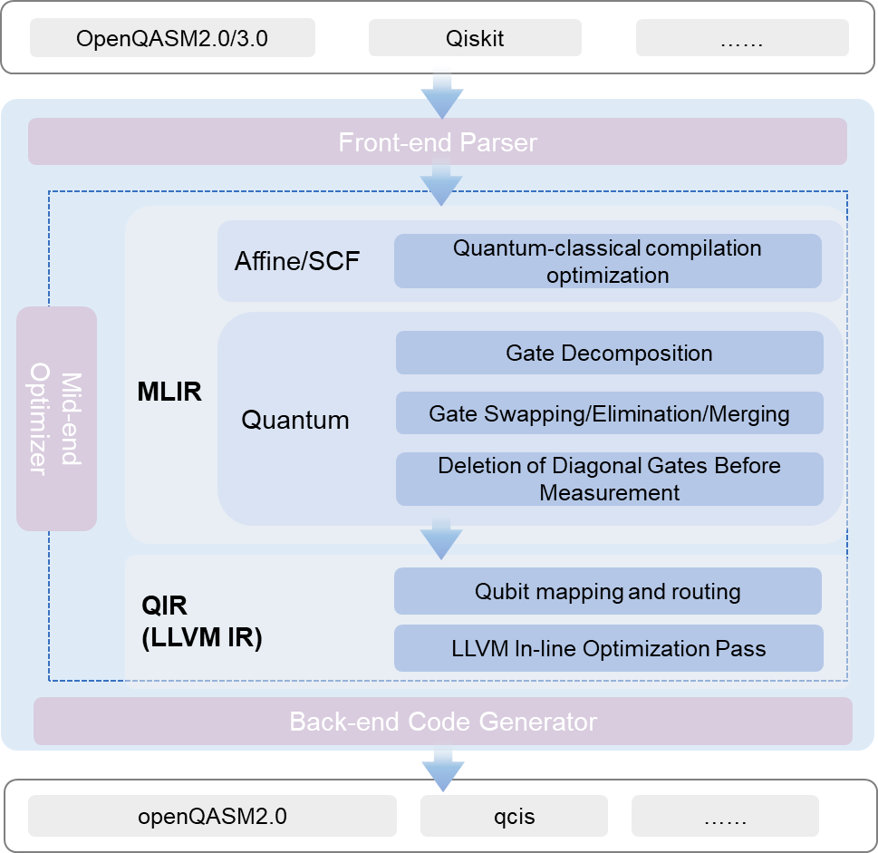
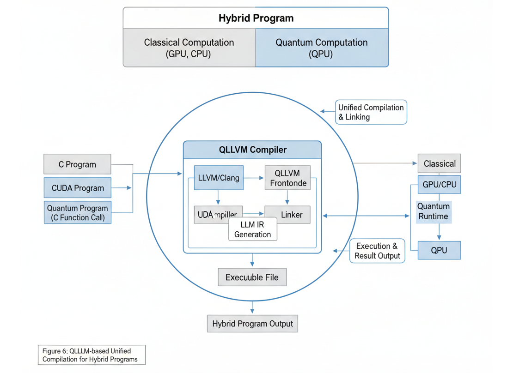
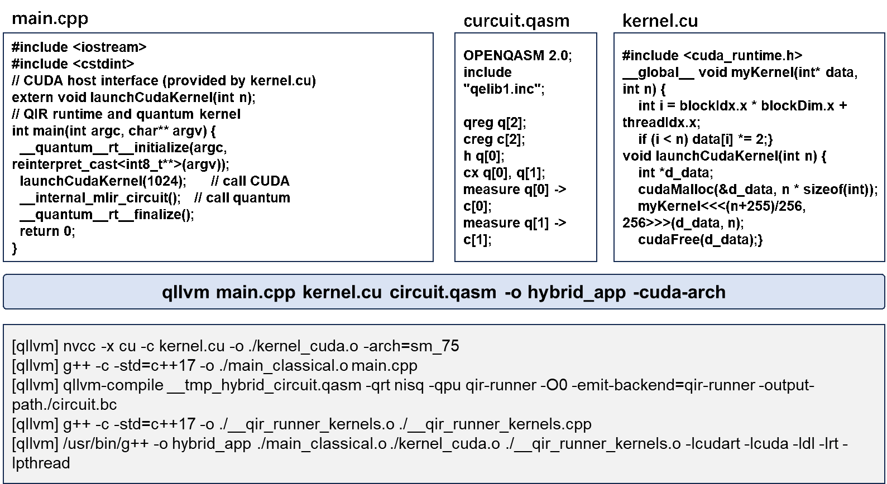

<div align="center">


# QLLVM 量子编译框架
<p align="center">
  <a href="README.md">English</a> | <a href="README.cn.md">中文</a>
</p>

<p align="center">
  <a href="https://openreview.net/forum?id=5N3z9JQJKq"></a>
  <a href="https://opensource.org/licenses/MIT"></a>
  <a href="https://www.python.org/"></a>
</p>


QLLVM量子编译框架是一个基于 **MLIR** 和 **LLVM IR** 构建的量子程序编译框架。支持多种量子编程语言输入，经过优化与映射后输出目标硬件支持的代码。我们同步推出了两种使用方式，通过源码安装命令行运行与使用VScode插件快捷执行。

[快速开始](#一-快速开始) • [QLLVM运行示例](#二-QLLVM运行示例) • [软件介绍](#三-编译参数说明) • [软件介绍](#四-软件介绍) • [项目结构概览](#五-项目结构概览)

</div>

***

## 一、快速开始

QLLVM 量子编译框架提供两种使用方式：通过 VSCode 插件快捷执行，或通过源码安装命令行运行。

### 1.1 VSCode 插件快捷执行

我们同步推出了两款自研 VSCode 插件，形成「**生成 → 编译 → 运行**」的完整开发闭环：

| 插件 | 功能定位 | 核心能力 |
|------|----------|----------|
| **Quantum Circuit Composer** | 量子编译工具 | 多编译器支持调用、远程/本地编译、QIR 模拟器运行 |
| **QCoder** | 量子编程助手 | 大模型对话、代码生成、RAG 知识增强 |

通过 VS Code 插件 **QCoder** 和 **Quantum Circuit Composer**，您可以无需本地编译 QLLVM，直接通过云编译方式使用，同时可大幅提升量子算法的开发效率：QCoder 生成量子电路代码，Quantum Circuit Composer 完成编译与仿真验证。

#### 1.1.2 插件安装

##### 从 VSIX 文件安装

1. 下载插件安装包：
   - `quantum-circuit-composer-*.vsix`
   - `qcoder-*.vsix`
2. 在 VSCode 中打开命令面板（`Ctrl+Shift+P` / `Cmd+Shift+P`）
3. 输入并选择 **Extensions: Install from VSIX...**
4. 依次选择下载的 `.vsix` 文件完成安装

#### 1.1.3 基础配置

##### Quantum Circuit Composer 配置

1. **打开编译器设置**：命令面板输入 **打开量子编译器设置**
2. **启用编译器**：在配置界面勾选需要的编译器（如 QLLVM、Qiskit、QPanda）
3. **配置编译器参数**：
   - **QLLVM**：设置设备类型（NISQ/FTQC）、后端类型（qasm-backend/benyuan/tianyan/zheda）、优化等级（O0/O1）等
   - **Python 环境**：支持自动检测系统 Python、虚拟环境（venv/conda）或手动指定解释器路径
   - **远程编译**：可配置 SSH 连接信息，将编译任务提交至远程服务器

##### QCoder 配置

1. **配置 API Key**（按需执行）：
   - `设置 QCoder Qwen API Key`：阿里云百炼
   - `设置 QCoder DeepSeek API Key`：DeepSeek
   - `设置 QCoder SCNet API Key`：自定义 SCNet 模型
2. **可选配置**：
   - `qcoder.qllvmInstallPath`：QLLVM 安装路径（用于快速开始）
   - `qcoder.uiLanguage`：界面语言（en/zh-CN/zh-TW）
   - **RAG 知识增强**：在聊天设置中开启「在线服务」，可获得基于量子计算知识库的增强回答

#### 1.1.4 使用流程

##### 完整开发闭环示例

| 阶段 | 工具 | 输入 | 输出 | 核心能力 |
|:----:|:----:|:----:|:----:|:--------:|
| **① 代码生成** | QCoder<br>量子助手 | 自然语言描述<br>(需求/算法思路) | 电路代码 | 大模型对话、RAG知识增强 |
| **② 编译与优化** | Quantum Circuit<br>Composer | 电路代码 | 编译后代码 | 多编译器支持<br>本地/远程编译 |
| **③ 仿真验证** | QIR 模拟器 | 优化后代码 | 仿真结果 | 量子电路仿真、测量统计 |

**数据流向：** 自然语言描述 → 电路代码 → 优化后代码 → 仿真结果

### 1.2 源码安装

如果您需要在本地环境中直接使用 QLLVM 命令行工具，或进行定制开发，可以选择源码编译安装。

#### 1.2.1 通用依赖

```bash
# 系统基础依赖
sudo apt-get update
sudo apt-get install -y build-essential cmake ninja-build \
  libcurl4-openssl-dev libssl-dev liblapack-dev libblas-dev \
  lsb-release git
```

**LLVM/MLIR**：QLLVM 需要带 MLIR 的 LLVM。推荐使用 `llvm` 预编译包，或从 [llvm-project-csp](https://github.com/ornl-qci/llvm-project-csp) 源码编译（启用 `clang;mlir`）。

```bash
# QLLVM 构建所需额外依赖
sudo apt-get install -y libantlr4-runtime-dev libeigen3-dev
```

#### 1.2.2 QLLVM 构建

```bash
# 克隆仓库
git clone <qllvm-repo-url> qllvm
cd qllvm

# 构建与安装
mkdir build && cd build
cmake .. -G Ninja \
  -DQLLVM_QASM_ONLY_BUILD=ON \
  -DLLVM_ROOT=$HOME/.llvm
ninja
ninja install
```

**安装路径**：默认安装到 `~/.qllvm`。`ninja install` 时会自动将 `~/.qllvm/bin` 加入当前用户的 shell 配置（.bashrc/.profile）。新开终端后即可使用。也可手动添加：

```bash
export PATH=$PATH:$HOME/.qllvm/bin
```

#### 1.2.3 可选依赖（按需安装）

| 功能 | 依赖 | 安装方式 |
|------|------|----------|
| **QIR Runner 模拟** | qir-runner、Python 3.9+ | `pip install qirrunner` |
| **经典-量子混合编译** | qir-runner | `pip install qirrunner` |
| **C++ + CUDA + QASM 混合** | CUDA Toolkit、nvcc、qir-runner | 见 1.2.4 |

#### 1.2.4 CUDA 环境（仅 C+++CUDA+QASM 混合需用）

若需编译 `examples/hybrid_cuda` 等 C++ + CUDA + QASM 混合程序，需安装 CUDA Toolkit。

**方式一：Ubuntu apt 安装（推荐）**

```bash
# 在 qllvm 仓库根目录执行
bash scripts/install_cuda_apt.sh
```

脚本会安装 `nvidia-cuda-toolkit` 并创建 Clang 兼容目录 `~/.qllvm/cuda-apt-compat`。安装完成后，qllvm 会在 nvcc 可用时自动使用 nvcc 编译 `.cu` 文件。

**方式二：NVIDIA 官方 runfile**

从 [NVIDIA CUDA 下载页](https://developer.nvidia.com/cuda-downloads) 下载 runfile，执行 `--toolkit` 仅安装工具链。安装后设置：

```bash
export CUDA_PATH=/usr/local/cuda
export PATH=$CUDA_PATH/bin:$PATH
```

**说明**：编译混合程序不需物理 GPU；运行生成的 `hybrid_app` 需 NVIDIA 显卡及驱动。

更详细的安装说明见 `docs/install_guide.md`。

#### 1.2.4 验证与测试

```bash
# 运行测试脚本
./scripts/test_openqasm_only.sh

# 手动验证
qllvm test/test_bell.qasm -qrt nisq -qpu qasm-backend -O1
cat test/test_bell_compiled.qasm
```
---

## 二、QLLVM运行示例

### 2.1 编译 OpenQASM 文件

**基本编译：**

```bash
# 使用 qllvm
qllvm test.qasm -qrt nisq -qpu qasm-backend -O1
# 输出：test_compiled.qasm
```

**指定输出路径：**

```bash
qllvm test.qasm -qrt nisq -qpu qasm-backend -O0 -o folder/try
# 输出：folder/try.qasm
```

**指定基础门组：**

```bash
qllvm test.qasm -qrt nisq -qpu qasm-backend -O1 -o folder/try \
  -basicgate=[rx,ry,rz,h,cx]
```

**带后端拓扑（SABRE 映射）：**

```bash
qllvm test.qasm -qrt nisq -qpu qasm-backend -O1 \
  -qpu-config backend.ini -initial-mapping '[0,1,2]' \
  -sabre-cpp
```

### 2.2 Bell 态示例

创建 `bell.qasm`：

```qasm
OPENQASM 2.0;
include "qelib1.inc";
qreg q[2];
creg q_c[2];
h q[0];
CX q[0], q[1];
measure q[0] -> q_c[0];
measure q[1] -> q_c[1];
```

编译并检查输出：

```bash
qllvm bell.qasm -qrt nisq -qpu qasm-backend -O1
cat bell_compiled.qasm
```

### 2.3 直接调用 qllvm-compile

```bash
# 不启用 SABRE
qllvm-compile test.qasm -internal-func-name test \
  -emit-backend=qasm-backend -output-path=test_out.qasm

# 启用 SABRE（线性链 0-1-2）
qllvm-compile test.qasm -internal-func-name test \
  -emit-backend=qasm-backend -output-path=test_sabre.qasm \
  -sabre-coupling-map="0,1;1,2"
```

### 2.4 打印 MLIR / QIR

```bash
qllvm test.qasm -emitmlir -qrt nisq -qpu qasm-backend -O1
qllvm test.qasm -emitqir -qrt nisq -qpu qasm-backend -O1
```

### 2.5 后端拓扑配置示例

`backend.ini` 或 `qpu_config_chain3.txt`：

```ini
# 线性链：0-1-2
connectivity = [[0, 1], [1, 2]]
```

---

## 三、编译参数说明

### 3.1 驱动程序（qllvm）参数

| 参数 | 说明 | 示例 |
|------|------|------|
| `-O0` | 不进行编译优化 | `-O0` |
| `-O1` | 使用固定优化遍序列 | `-O1` |
| `-basicgate` | 指定基础门组 | `-basicgate=[rx,ry,rz,h,cz]`、`-basicgate=[rx,ry,rz,h,cx]`、`-basicgate=[su2,x,y,z,cz]`（对接测控） |
| `-qrt` | 指定设备类型 | `-qrt nisq`、`-qrt ftqc` |
| `-qpu` | 指定后端类型 | `-qpu qasm-backend` |
| `-qpu-config` | 指定后端拓扑结构（耦合图） | `-qpu-config ./backend.ini` |
| `-emitmlir` | 打印 MLIR 程序 | `-emitmlir` |
| `-emitqir` | 打印 QIR 程序 | `-emitqir` |
| `-customPassSequence` | 指定优化遍序列文件 | `-customPassSequence=./pass.txt` |
| `-o` | 指定输出路径及文件名 | `-o folder/name` |
| `-placement` | 指定映射方法 | `-placement sabre_swap`、`-placement swap_shortest_path` |
| `-initial-mapping` | 指定初始比特映射 | `-initial-mapping '[0,1,2,3,4]'` |
| `-sabre-cpp` | 在 LLVM IR 阶段使用 C++ SABRE（需配合 `-initial-mapping` 和 `-qpu-config`） | `-sabre-cpp` |
| `-circuit-state` | 打印电路状态（深度、门数） | `-circuit-state` |
| `-pass-count` | 打印各 Pass 执行次数 | `-pass-count` |
| `-v` / `--verbose` | 开启详细输出 | `-v` |
| `-cuda-arch` | 混合 CUDA 时指定 GPU 架构 | `-cuda-arch sm_75` |
| `-cuda-path` | 混合 CUDA 时指定 CUDA 安装路径（可选，默认用 `CUDA_PATH` 或 nvcc 推导） | `-cuda-path /usr/local/cuda` |

**常用基础门组：**

- `[rx,ry,rz,h,cz]`：默认
- `[rx,ry,rz,h,cx]`：使用 CX
- `[su2,x,y,z,cz]`：对接测控系统

### 3.2 qllvm-compile 参数

| 参数 | 说明 |
|------|------|
| `<input.qasm>` |  positional，输入 OpenQASM 文件 |
| `-internal-func-name` | 生成的内核函数名 |
| `-no-entrypoint` | 不生成 main 入口 |
| `-O0` | 优化等级 0 |
| `-O1` | 优化等级 1 |
| `-qpu` | 目标量子后端 |
| `-qrt` | 量子执行模式（nisq/ftqc） |
| `-emitmlir` | 打印 MLIR |
| `-emitqir` | 打印 QIR |
| `-emit-backend` | 指定发射后端（如 `qasm-backend`） |
| `-output-path` | 输出文件路径 |
| `-output-ll` | 输出 LLVM IR 路径（用于混合编译链接） |
| `-sabre-coupling-map` | SABRE 耦合图，边格式 `0,1;1,2;2,3` |
| `-circuit-state` | 打印电路深度和门数 |
| `-pass-count` | 打印各 Pass 执行次数 |
| `-basicgate` | 基础门组 |
| `-customPassSequence` | 自定义 Pass 序列文件 |
| `-verbose-error` | 出错时打印完整 MLIR |
| `--pass-timing` | Pass 耗时统计 |
| `--print-ir-after-all` | 每 Pass 后打印 IR |
| `--print-ir-before-all` | 每 Pass 前打印 IR |

### 3.3 CMake 构建参数

| 参数 | 说明 |
|------|------|
| `-DLLVM_ROOT` | LLVM 安装路径（含 MLIR） |
| `-DXACC_DIR` | 可选依赖路径（antlr4/exprtk）；QASM-only 独立构建时设为空即 `-DXACC_DIR=` |
| `-DCMAKE_INSTALL_PREFIX` | 安装目录（默认 ~/.qllvm） |
| `-DQLLVM_QASM_ONLY_BUILD=ON` | 启用 QASM-only 独立构建 |


## 四、软件介绍

### 4.1 总体功能

QLLVM 将高级量子程序编译为目标后端可执行代码，主要功能包括：

| 功能模块 | 说明 |
|----------|------|
| **多语言前端** | 支持 OpenQASM 2.0/3.0、Qiskit QuantumCircuit、Q# 等输入 |
| **MLIR 优化** | 单比特门合并、抵消、对角门移除、门综合等优化 Pass |
| **QIR 生成** | 将 MLIR 方言 Lowering 为 QIR（LLVM IR 形式的量子中间表示） |
| **SABRE 映射** | C++/Qiskit 实现的量子比特布局与 SWAP 插入 |
| **多后端发射** | 输出 OpenQASM、硬件特定格式等 |

**编译流水线：**

```
QASM 源文件 → 预处理 → MLIR (Quantum 方言) → 优化 Passes → Lowering → LLVM IR (QIR) → 后端发射
```

### 4.2 技术路线

<div align="center">



QLLVM编译框架

</div>

- **前端**：负责语言解析和中间代码生成，将高级语言转换为 MLIR Quantum 方言
- **中端**：基于 MLIR 进行量子程序优化，并将 MLIR 进一步 Lowering 为 QIR（LLVM IR）
- **后端**：基于 QIR 和 QIR 运行时库，将程序转换为目标硬件支持的代码格式

### 4.3 主要优势

1. **工业级 IR 基础设施**：基于 MLIR/LLVM，便于扩展新方言和新 Pass
2. **多种输入形式**：OpenQASM、Qiskit、Q# 等，适配不同编程习惯
3. **灵活优化**：-O0/-O1 等级、自定义 Pass 序列、合成优化
4. **物理约束映射**：SABRE 等布局与 SWAP 策略，适配真实硬件拓扑

### 4.4 可选依赖

#### 4.4.1 QIR Runner 后端

输出 LLVM 位码 (.bc) 供 QIR Runner 模拟器加载。qllvm 内置 **QirRunnerCompat** 自动适配 qir-runner 的 QIR base profile（`__quantum__rt__initialize` 签名、`__body` 后缀、mz 结果索引等）。

```bash
# 1. 安装 qir-runner (conda qllvm 环境)
conda activate qllvm
pip install qirrunner

# 2. 用 qllvm-compile 生成 .bc
qllvm-compile bell.qasm -qrt nisq -qpu qir-runner -O1 \
  -emit-backend=qir-runner -output-path=bell.bc

# 3. 用 qir-runner 运行
qir-runner -f bell.bc -s 5
```

##### qir-runner 输出格式说明

每次 shot 的输出结构：

| 行 | 含义 |
|----|------|
| `START` | 一次 shot 开始 |
| `METADATA\tEntryPoint` | 入口点元数据 |
| `RESULT\t0` 或 `RESULT\t1` | 各 qubit 的测量结果（按测量顺序） |
| `END\t0` | 该 shot 结束 |

示例（Bell 电路 5 shots）：

```
START
METADATA	EntryPoint
RESULT	0
RESULT	0
END	0
START
METADATA	EntryPoint
RESULT	1
RESULT	1
END	0
...
```

##### qir-runner 命令行参数

| 参数 | 说明 | 默认值 |
|------|------|--------|
| `-f, --file <PATH>` | QIR 位码文件路径（必需） | - |
| `-s, --shots <NUM>` | 模拟 shot 次数 | 1 |
| `-r, --rngseed <NUM>` | 随机数种子（可复现） | 随机 |
| `-e, --entrypoint <NAME>` | 入口函数名 | EntryPoint |

##### 输出为 Qiskit 风格 counts

使用 `scripts/qir_runner_counts.py` 将原始输出转换为 Qiskit 风格的 `get_counts()` 字典：

```bash
# 管道方式
qir-runner -f bell.bc -s 100 | python3 scripts/qir_runner_counts.py -

# 直接指定 bc 与参数
python3 scripts/qir_runner_counts.py bell.bc -s 100 -r 42
```

- **输出示例（Bell 态）**：`{'00': 48, '11': 52}`

- **协同测试脚本**：`./scripts/test_qllvm_qirrunner.sh`

`.bc` 为标准 LLVM 位码，可被 [qir-alliance/qir-runner](https://github.com/qir-alliance/qir-runner) 等工具加载（需 Python 3.9+）。

#### 4.4.2 经典-量子混合编译
依托LLVM生态，QLLVM能够实现与经典编译Pass、CUDA编程模型和HPC运行时的集成，从而实现高效的经典量子混合任务编译。

<div align="center">



经典量子混合程序编译机制

</div>

支持将 C++ 主程序与 QASM 量子电路混合编译为单一可执行文件：

```bash
# 混合编译（qir-qrt-stub 桩实现）
qllvm main.cpp circuit.qasm -o hybrid_app

# 示例位于 examples/hybrid/
qllvm examples/hybrid/main.cpp examples/hybrid/bell.qasm -o hybrid_bell
./hybrid_bell
```


##### 使用 qir-runner 作为模拟器

```bash
# 混合编译 + qir-runner 模拟（生成 exe 与 .bc）
qllvm main.cpp bell.qasm -qpu qir-runner -o hybrid_bell -O1

# 运行（需 qir-runner 在 PATH 中）
./hybrid_bell -shots 10
```

- **工作流程**：QASM → QIR .bc (qir-runner) + C++ 编译 → 可执行文件在运行时间接调用 qir-runner 子进程模拟量子电路。

- **协同测试脚本**：`./scripts/test_hybrid_qirrunner.sh`

详见 `examples/hybrid/README.md`。

##### C++ + CUDA + QASM 混合编译
<div align="center">



混合程序代码编写示例

</div>
支持将 C++ 主程序、CUDA 内核与 QASM 量子电路混合编译为单一可执行文件（需 CUDA 环境）：

```bash
cd examples/hybrid_cuda

# 编译（-cuda-arch 指定 GPU 架构，如 sm_75、sm_86）
qllvm main.cpp kernel.cu circuit.qasm -o hybrid_app \
      -cuda-arch sm_75 \
      -cuda-path /usr/local/cuda

# 若 nvcc 在 PATH 中，可省略 -cuda-path，将自动推导
qllvm main.cpp kernel.cu circuit.qasm -o hybrid_app -cuda-arch sm_86

# 运行
./hybrid_app -shots 1024
```

- **依赖**：Clang（支持 `-x cuda`）、CUDA Toolkit、qir-runner（`pip install qirrunner`）。

- **Ubuntu apt 安装 CUDA**：运行 `bash scripts/install_cuda_apt.sh` 可自动安装 nvidia-cuda-toolkit 并创建 Clang 兼容目录（`~/.qllvm/cuda-apt-compat`）。详见 `examples/hybrid_cuda/README.md`。


---


## 五、项目结构概览

| 目录 | 说明 |
|------|------|
| `mlir/` | MLIR 方言、解析器、转换、Lowering |
| `mlir/dialect/` | Quantum 方言定义 |
| `mlir/parsers/` | OpenQASM3、Qiskit 解析器 |
| `mlir/transforms/` | 优化 Pass（门合并、抵消、综合等） |
| `mlir/tools/` | `qllvm-compile` 主编译器 |
| `passes/` | LLVM IR Pass（SABRE 等） |
| `backend/` | QIR → 后端代码（如 QasmBackend） |
| `tools/driver/` | 驱动脚本 `qllvm.in` |
| `test/` | 测试与示例 QASM |
| `docs/` | 安装指南（install_guide.md）、设计文档 |

---


