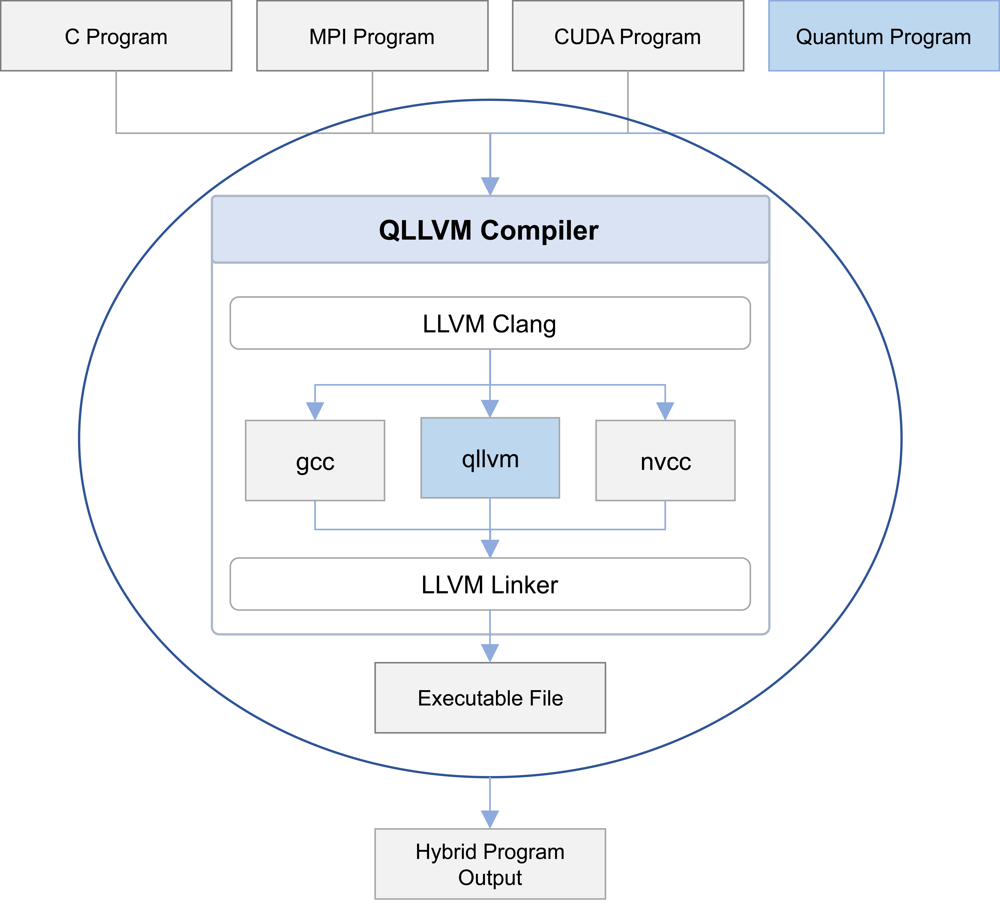

<div align="center">


# QLLVM Quantum Compilation Framework
<p align="center">
  <a href="README.md">English</a> | <a href="README.cn.md">中文</a>
</p>

<p align="center">
  <a href="https://openreview.net/forum?id=5N3z9JQJKq"></a>
  <a href="https://opensource.org/licenses/MIT"></a>
  <a href="https://www.python.org/"></a>
</p>


QLLVM is a quantum program compilation framework built on **MLIR** and **LLVM IR**. It supports multiple quantum programming language inputs, and outputs code supported by target hardware after optimization and mapping. We provide two usage methods: command-line execution through source code installation and quick execution using VSCode plugins.

[Quick Start](#i-quick-start) • [QLLVM Run Examples](#ii-qllvm-run-examples) • [Compilation Parameter Explanation](#iii-compilation-parameter-explanation) • [Software Introduction](#iv-software-introduction) • [Proiect Structure Overview](#v-proiect-structure-overview)

</div>

***

## I. Quick Start

QLLVM Quantum Compilation Framework provides two usage methods: quick execution through VSCode plugins, or command-line execution through source code installation.

### 1.1 VSCode Plugin Quick Execution

We have launched two self-developed VSCode plugins to form a complete development loop of "**Generate → Compile → Run**":

| Plugin | Function Positioning | Core Capabilities |
|--------|---------------------|-------------------|
| **Quantum Circuit Composer** | Quantum Compilation Tool | Multi-compiler support, remote/local compilation, QIR simulator running |
| **QCoder** | Quantum Programming Assistant | Large model dialogue, code generation, RAG knowledge enhancement |

Through VS Code plugins **QCoder** and **Quantum Circuit Composer**, you can use QLLVM directly through cloud compilation without local compilation, while greatly improving the development efficiency of quantum algorithms: QCoder generates quantum circuit code, and Quantum Circuit Composer completes compilation and simulation verification.

#### 1.1.2 Plugin Installation

##### Install from VSIX File

1. Download plugin installation packages:
   - `quantum-circuit-composer-*.vsix`
   - `qcoder-*.vsix`
2. Open the command palette in VSCode (`Ctrl+Shift+P` / `Cmd+Shift+P`)
3. Enter and select **Extensions: Install from VSIX...**
4. Select the downloaded `.vsix` files in sequence to complete the installation

#### 1.1.3 Basic Configuration

##### Quantum Circuit Composer Configuration

1. **Open compiler settings**: Enter **Open Quantum Compiler Settings** in the command palette
2. **Enable compilers**: Check the required compilers in the configuration interface (such as QLLVM, Qiskit, QPanda)
3. **Configure compiler parameters**:
   - **QLLVM**: Set device type (NISQ/FTQC), backend type (qasm-backend/benyuan/tianyan/zheda), optimization level (O0/O1), etc.
   - **Python environment**: Supports automatic detection of system Python, virtual environments (venv/conda), or manually specified interpreter path
   - **Remote compilation**: Can configure SSH connection information to submit compilation tasks to remote servers

##### QCoder Configuration

1. **Configure API Key** (execute as needed):
   - `Set QCoder Qwen API Key`: Alibaba Cloud
   - `Set QCoder DeepSeek API Key`: DeepSeek
   - `Set QCoder SCNet API Key`: Custom SCNet model
2. **Optional configuration**:
   - `qcoder.qllvmInstallPath`: QLLVM installation path (for quick start)
   - `qcoder.uiLanguage`: Interface language (en/zh-CN/zh-TW)
   - **RAG knowledge enhancement**: Enable "Online Service" in chat settings to get enhanced answers based on quantum computing knowledge base

#### 1.1.4 Usage Process

##### Complete Development Loop Example

| Stage | Tool | Input | Output | Core Capabilities |
|:-----:|:-----|:-----:|:------:|:-----------------|
| **① Code Generation** | QCoder<br>Quantum Assistant | Natural language description<br>(requirements/algorithm ideas) | Circuit code | Large model dialogue, RAG knowledge enhancement |
| **② Compilation and Optimization** | Quantum Circuit<br>Composer | Circuit code | Compiled code | Multi-compiler support<br>local/remote compilation |
| **③ Simulation Verification** | QIR Simulator | Optimized code | Simulation results | Quantum circuit simulation, measurement statistics |

**Data flow**: Natural language description → Circuit code → Optimized code → Simulation results

### 1.2 Source Code Installation

If you need to directly use the QLLVM command-line tool in your local environment or perform custom development, you can choose to compile and install from source code.

#### 1.2.1 Common Dependencies

```bash
# System basic dependencies
sudo apt-get update
sudo apt-get install -y build-essential cmake ninja-build \
  libcurl4-openssl-dev libssl-dev liblapack-dev libblas-dev \
  lsb-release git
```

**LLVM/MLIR**: QLLVM requires LLVM with MLIR. It is recommended to use the `llvm` precompiled package, or compile from [llvm-project-csp](https://github.com/ornl-qci/llvm-project-csp) source code (enable `clang;mlir`).

```bash
# Additional dependencies required for QLLVM build
sudo apt-get install -y libantlr4-runtime-dev libeigen3-dev
```

#### 1.2.2 QLLVM Build

```bash
# Clone repository
git clone <qllvm-repo-url> qllvm
cd qllvm

# Build and install
mkdir build && cd build
cmake .. -G Ninja \
  -DQLLVM_QASM_ONLY_BUILD=ON \
  -DLLVM_ROOT=$HOME/.llvm
ninja
ninja install
```

**Installation path**: Default installation to `~/.qllvm`. During `ninja install`, it will automatically add `~/.qllvm/bin` to the current user's shell configuration (.bashrc/.profile). It can be used after opening a new terminal. You can also add it manually:

```bash
export PATH=$PATH:$HOME/.qllvm/bin
```

#### 1.2.3 Optional Dependencies (install as needed)

| Function | Dependency | Installation Method |
|----------|------------|---------------------|
| **QIR Runner Simulation** | qir-runner, Python 3.9+ | `pip install qirrunner` |
| **Classical-Quantum Hybrid Compilation** | qir-runner | `pip install qirrunner` |
| **C++ + CUDA + QASM Hybrid** | CUDA Toolkit, nvcc, qir-runner | See 1.2.4 |

#### 1.2.4 CUDA Environment (only needed for C+++CUDA+QASM hybrid)

If you need to compile C++ + CUDA + QASM hybrid programs such as `examples/hybrid_cuda`, you need to install CUDA Toolkit.

**Method 1: Ubuntu apt installation (recommended)**

```bash
# Execute in the qllvm repository root directory
bash scripts/install_cuda_apt.sh
```

The script will install `nvidia-cuda-toolkit` and create a Clang compatible directory `~/.qllvm/cuda-apt-compat`. After installation, qllvm will automatically use nvcc to compile `.cu` files when nvcc is available.

**Method 2: NVIDIA official runfile**

Download the runfile from [NVIDIA CUDA download page](https://developer.nvidia.com/cuda-downloads), execute `--toolkit` to install only the toolchain. After installation, set:

```bash
export CUDA_PATH=/usr/local/cuda
export PATH=$CUDA_PATH/bin:$PATH
```

**Note**: Compiling hybrid programs does not require a physical GPU; running the generated `hybrid_app` requires an NVIDIA graphics card and driver.

For more detailed installation instructions, see `docs/install_guide.md`.

#### 1.2.4 Verification and Testing

```bash
# Run test script
./scripts/test_openqasm_only.sh

# Manual verification
qllvm test/test_bell.qasm -qrt nisq -qpu qasm-backend -O1
cat test/test_bell_compiled.qasm
```

---


## II. QLLVM Run Examples

### 2.1 Compiling OpenQASM Files

**Basic compilation:**

```bash
# Using qllvm
qllvm test.qasm -qrt nisq -qpu qasm-backend -O1
# Output: test_compiled.qasm
```

**Specifying output path:**

```bash
qllvm test.qasm -qrt nisq -qpu qasm-backend -O0 -o folder/try
# Output: folder/try.qasm
```

**Specifying basic gate set:**

```bash
qllvm test.qasm -qrt nisq -qpu qasm-backend -O1 -o folder/try \
  -basicgate=[rx,ry,rz,h,cx]
```

**With backend topology (SABRE mapping):**

```bash
qllvm test.qasm -qrt nisq -qpu qasm-backend -O1 \
  -qpu-config backend.ini -initial-mapping '[0,1,2]' \
  -sabre-cpp
```

### 2.2 Bell State Example

Create `bell.qasm`:

```qasm
OPENQASM 2.0;
include "qelib1.inc";
qreg q[2];
creg q_c[2];
h q[0];
CX q[0], q[1];
measure q[0] -> q_c[0];
measure q[1] -> q_c[1];
```

Compile and check output:

```bash
qllvm bell.qasm -qrt nisq -qpu qasm-backend -O1
cat bell_compiled.qasm
```

### 2.3 Directly Calling qllvm-compile

```bash
# Without SABRE
qllvm-compile test.qasm -internal-func-name test \
  -emit-backend=qasm-backend -output-path=test_out.qasm

# With SABRE (linear chain 0-1-2)
qllvm-compile test.qasm -internal-func-name test \
  -emit-backend=qasm-backend -output-path=test_sabre.qasm \
  -sabre-coupling-map="0,1;1,2"
```

### 2.4 Printing MLIR / QIR

```bash
qllvm test.qasm -emitmlir -qrt nisq -qpu qasm-backend -O1
qllvm test.qasm -emitqir -qrt nisq -qpu qasm-backend -O1
```

### 2.5 Backend Topology Configuration Example

`backend.ini` or `qpu_config_chain3.txt`:

```ini
# Linear chain: 0-1-2
connectivity = [[0, 1], [1, 2]]
```

---

## III. Compilation Parameter Explanation

### 3.1 Driver Program (qllvm) Parameters

| Parameter | Description | Example |
|-----------|-------------|---------|
| `-O0` | No compilation optimization | `-O0` |
| `-O1` | Use fixed optimization pass sequence | `-O1` |
| `-basicgate` | Specify basic gate set | `-basicgate=[rx,ry,rz,h,cz]`, `-basicgate=[rx,ry,rz,h,cx]`, `-basicgate=[su2,x,y,z,cz]` (for measurement and control) |
| `-qrt` | Specify device type | `-qrt nisq`, `-qrt ftqc` |
| `-qpu` | Specify backend type | `-qpu qasm-backend` |
| `-qpu-config` | Specify backend topology (coupling graph) | `-qpu-config ./backend.ini` |
| `-emitmlir` | Print MLIR program | `-emitmlir` |
| `-emitqir` | Print QIR program | `-emitqir` |
| `-customPassSequence` | Specify optimization pass sequence file | `-customPassSequence=./pass.txt` |
| `-o` | Specify output path and filename | `-o folder/name` |
| `-placement` | Specify mapping method | `-placement sabre_swap`, `-placement swap_shortest_path` |
| `-initial-mapping` | Specify initial qubit mapping | `-initial-mapping '[0,1,2,3,4]'` |
| `-sabre-cpp` | Use C++ SABRE in LLVM IR phase (requires `-initial-mapping` and `-qpu-config`) | `-sabre-cpp` |
| `-circuit-state` | Print circuit state (depth, gate count) | `-circuit-state` |
| `-pass-count` | Print execution count of each pass | `-pass-count` |
| `-v` / `--verbose` | Enable detailed output | `-v` |
| `-cuda-arch` | Specify GPU architecture for hybrid CUDA | `-cuda-arch sm_75` |
| `-cuda-path` | Specify CUDA installation path for hybrid CUDA (optional, default uses `CUDA_PATH` or nvcc deduction) | `-cuda-path /usr/local/cuda` |

**Common basic gate sets:**

- `[rx,ry,rz,h,cz]`: Default
- `[rx,ry,rz,h,cx]`: Using CX
- `[su2,x,y,z,cz]`: For measurement and control systems

### 3.2 qllvm-compile Parameters

| Parameter | Description |
|-----------|-------------|
| `<input.qasm>` | positional, input OpenQASM file |
| `-internal-func-name` | Generated kernel function name |
| `-no-entrypoint` | Do not generate main entry |
| `-O0` | Optimization level 0 |
| `-O1` | Optimization level 1 |
| `-qpu` | Target quantum backend |
| `-qrt` | Quantum execution mode (nisq/ftqc) |
| `-emitmlir` | Print MLIR |
| `-emitqir` | Print QIR |
| `-emit-backend` | Specify emission backend (e.g., `qasm-backend`) |
| `-output-path` | Output file path |
| `-output-ll` | Output LLVM IR path (for hybrid compilation linking) |
| `-sabre-coupling-map` | SABRE coupling map, edge format `0,1;1,2;2,3` |
| `-circuit-state` | Print circuit depth and gate count |
| `-pass-count` | Print execution count of each pass |
| `-basicgate` | Basic gate set |
| `-customPassSequence` | Custom pass sequence file |
| `-verbose-error` | Print complete MLIR on error |
| `--pass-timing` | Pass timing statistics |
| `--print-ir-after-all` | Print IR after each pass |
| `--print-ir-before-all` | Print IR before each pass |

### 3.3 CMake Build Parameters

| Parameter | Description |
|-----------|-------------|
| `-DLLVM_ROOT` | LLVM installation path (including MLIR) |
| `-DXACC_DIR` | Optional dependency path (antlr4/exprtk); set to empty for QASM-only independent build: `-DXACC_DIR=` |
| `-DCMAKE_INSTALL_PREFIX` | Installation directory (default ~/.qllvm) |
| `-DQLLVM_QASM_ONLY_BUILD=ON` | Enable QASM-only independent build |


## IV. Software Introduction

### 4.1 Overall Features

QLLVM compiles high-level quantum programs into target back-end executable code, with the following main features:

| Function Module | Description |
|----------------|-------------|
| **Multi-language front-end** | Supports OpenQASM 2.0/3.0, Qiskit QuantumCircuit, Q# and other inputs |
| **MLIR optimization** | Single-qubit gate merging, cancellation, diagonal gate removal, gate synthesis and other optimization passes |
| **QIR generation** | Lowering MLIR dialects to QIR (quantum intermediate representation in LLVM IR form) |
| **SABRE mapping** | C++/Qiskit implementation of qubit layout and SWAP insertion |
| **Multi-backend emission** | Output OpenQASM, hardware-specific formats, etc. |

**Compilation pipeline:**

```
QASM source file → Preprocessing → MLIR (Quantum dialect) → Optimization Passes → Lowering → LLVM IR (QIR) → Backend emission
```

### 4.2 Technical Route

<div align="center">


QLLVM Compilation Framework

</div>

- **Front-end**: Responsible for language parsing and intermediate code generation, converting high-level languages to MLIR Quantum dialect
- **Middle-end**: Perform quantum program optimization based on MLIR, and further lower MLIR to QIR (LLVM IR)
- **Back-end**: Based on QIR and QIR runtime library, convert programs to code formats supported by target hardware

### 4.3 Key Advantages

1. **Industrial-grade IR infrastructure**: Based on MLIR/LLVM, easy to extend new dialects and new passes
2. **Multiple input forms**: OpenQASM, Qiskit, Q# etc., adapting to different programming habits
3. **Flexible optimization**: -O0/-O1 levels, custom pass sequences, synthesis optimization
4. **Physical constraint mapping**: SABRE and other layout and SWAP strategies, adapting to real hardware topology

### 4.4 Optional Dependencies

#### 4.4.1 QIR Runner Backend

Output LLVM bitcode (.bc) for QIR Runner simulator loading. qllvm has built-in **QirRunnerCompat** to automatically adapt to qir-runner's QIR base profile (`__quantum__rt__initialize` signature, `__body` suffix, mz result index, etc.).

```bash
# 1. Install qir-runner (conda qllvm environment)
conda activate qllvm
pip install qirrunner

# 2. Generate .bc with qllvm-compile
qllvm-compile bell.qasm -qrt nisq -qpu qir-runner -O1 \
  -emit-backend=qir-runner -output-path=bell.bc

# 3. Run with qir-runner
qir-runner -f bell.bc -s 5
```

##### qir-runner Output Format Explanation

Output structure for each shot:

| Line | Meaning |
|------|---------|
| `START` | Start of a shot |
| `METADATA\tEntryPoint` | Entry point metadata |
| `RESULT\t0` or `RESULT\t1` | Measurement results for each qubit (in measurement order) |
| `END\t0` | End of the shot |

Example (Bell circuit 5 shots):

```
START
METADATA	EntryPoint
RESULT	0
RESULT	0
END	0
START
METADATA	EntryPoint
RESULT	1
RESULT	1
END	0
...
```

##### qir-runner Command Line Parameters

| Parameter | Description | Default Value |
|-----------|-------------|---------------|
| `-f, --file <PATH>` | QIR bitcode file path (required) | - |
| `-s, --shots <NUM>` | Number of simulated shots | 1 |
| `-r, --rngseed <NUM>` | Random number seed (reproducible) | Random |
| `-e, --entrypoint <NAME>` | Entry function name | EntryPoint |

##### Output as Qiskit-style counts

Use `scripts/qir_runner_counts.py` to convert raw output to Qiskit-style `get_counts()` dictionary:

```bash
# Pipeline方式
qir-runner -f bell.bc -s 100 | python3 scripts/qir_runner_counts.py -

# Directly specify bc and parameters
python3 scripts/qir_runner_counts.py bell.bc -s 100 -r 42
```

- **Output example (Bell state)**: `{'00': 48, '11': 52}`

- **Coordinated test script**: `./scripts/test_qllvm_qirrunner.sh`

`.bc` is standard LLVM bitcode, which can be loaded by tools such as [qir-alliance/qir-runner](https://github.com/qir-alliance/qir-runner) (requires Python 3.9+).

#### 4.4.2 Classical-Quantum Hybrid Compilation
Relying on the LLVM ecosystem, QLLVM can realize integration with classical compilation passes, CUDA programming model, and HPC runtime, thereby achieving efficient classical-quantum hybrid task compilation.

<div align="center">



Classical-Quantum Hybrid Program Compilation Mechanism

</div>

Supports hybrid compilation of C++ main program and QASM quantum circuit into a single executable file:

```bash
# Hybrid compilation (qir-qrt-stub implementation)
qllvm main.cpp circuit.qasm -o hybrid_app

# Example located at examples/hybrid/
qllvm examples/hybrid/main.cpp examples/hybrid/bell.qasm -o hybrid_bell
./hybrid_bell
```


##### Using qir-runner as Simulator

```bash
# Hybrid compilation + qir-runner simulation (generate exe and .bc)
qllvm main.cpp bell.qasm -qpu qir-runner -o hybrid_bell -O1

# Run (requires qir-runner in PATH)
./hybrid_bell -shots 10
```

- **Workflow**: QASM → QIR .bc (qir-runner) + C++ compilation → Executable file indirectly calls qir-runner subprocess to simulate quantum circuit at runtime.

- **Coordinated test script**: `./scripts/test_hybrid_qirrunner.sh`

See `examples/hybrid/README.md` for details.

##### C++ + CUDA + QASM Hybrid Compilation
<div align="center">


Hybrid Program Code Writing Example

</div>
Supports hybrid compilation of C++ main program, CUDA kernel, and QASM quantum circuit into a single executable file (requires CUDA environment):

```bash
cd examples/hybrid_cuda

# Compile (-cuda-arch specifies GPU architecture, such as sm_75, sm_86)
qllvm main.cpp kernel.cu circuit.qasm -o hybrid_app \
      -cuda-arch sm_75 \
      -cuda-path /usr/local/cuda

# If nvcc is in PATH, -cuda-path can be omitted, it will be automatically deduced
qllvm main.cpp kernel.cu circuit.qasm -o hybrid_app -cuda-arch sm_86

# Run
./hybrid_app -shots 1024
```

- **Dependencies**: Clang (supports `-x cuda`), CUDA Toolkit, qir-runner (`pip install qirrunner`).

- **Ubuntu apt install CUDA**: Run `bash scripts/install_cuda_apt.sh` to automatically install nvidia-cuda-toolkit and create a Clang compatible directory (`~/.qllvm/cuda-apt-compat`). See `examples/hybrid_cuda/README.md` for details.


---


## V. Project Structure Overview

| Directory | Description |
|-----------|-------------|
| `mlir/` | MLIR dialect, parser, transformation, Lowering |
| `mlir/dialect/` | Quantum dialect definition |
| `mlir/parsers/` | OpenQASM3, Qiskit parsers |
| `mlir/transforms/` | Optimization passes (gate merging, cancellation, synthesis, etc.) |
| `mlir/tools/` | `qllvm-compile` main compiler |
| `passes/` | LLVM IR passes (SABRE, etc.) |
| `backend/` | QIR → backend code (e.g., QasmBackend) |
| `tools/driver/` | Driver script `qllvm.in` |
| `test/` | Test and example QASM |
| `docs/` | Installation guide (install_guide.md), design documents |

---
